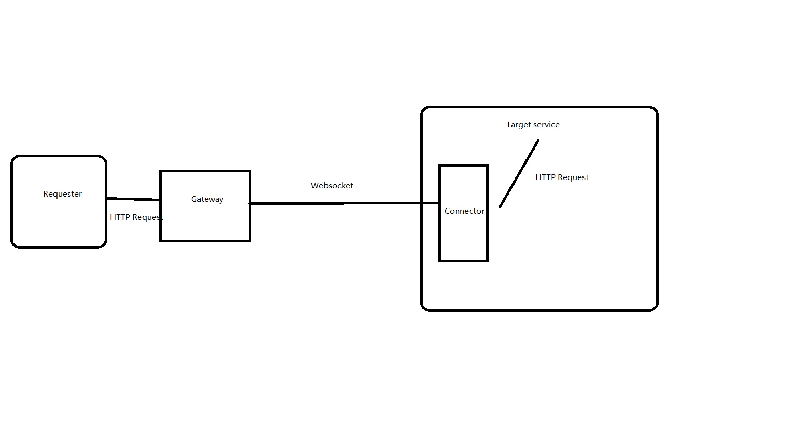

# vertx-http-gateway
[](https://search.maven.org/artifact/io.github.pangzixiang.whatsit/vertx-http-gateway)
[](https://www.npmjs.com/package/vertx-http-gateway-js-connector)
### How does it work?

- Once requester send the request to Gateway, Gateway would transfer the request to the Connector via Websocket.
- Connector and the Target Service are in the same JVM, hence Target server doesn't need to open its PORT.
- Once Connector receives the request from Gateway, it would trigger the HTTP request to the Target Service and transfer back the response to Gateway.
### How to use it?
- Import the dependency
```xml
<dependency>
    <groupId>io.github.pangzixiang.whatsit</groupId>
    <artifactId>vertx-http-gateway</artifactId>
    <version>{latestVersion}</version>
</dependency>
```
- Deploy the Verticle 'VertxHttpGatewayMainVerticle'
```java
public class Main {
    public static void main(String[] args) {
        Vertx vertx = Vertx.vertx();
        VertxHttpGatewayOptions options = new VertxHttpGatewayOptions();
        vertx.deployVerticle(new VertxHttpGatewayMainVerticle(options));
    }
}
```

- Design your own load-balancing algorithm
```java
public class YourAlgorithm implements LoadBalanceAlgorithm {
    @Override
    public Future<ServiceRegistrationInstance> handle(Vertx vertx, HttpServerRequest httpServerRequest, ServiceRegistrationInfo serviceRegistrationInfo) {
        
    }
}

public class Main {
    public static void main(String[] args) {
        Vertx vertx = Vertx.vertx();
        VertxHttpGatewayOptions options = new VertxHttpGatewayOptions();
        options.setLoadBalanceAlgorithm(new YourAlgorithm());
        vertx.deployVerticle(new VertxHttpGatewayMainVerticle(options));
    }
}
```

- customize the Events
```java
public class YourEventHandler implements EventHandler {
    @Override
    public Future<Void> beforeEstablishConnection(RoutingContext routingContext) {
        log.info("beforeEstablishConnection");
        return Future.succeededFuture();
    }

    @Override
    public void afterEstablishConnection(String serviceName, ServiceRegistrationInstance serviceRegistrationInstance) {
        log.info("afterEstablishConnection");
    }

    @Override
    public void beforeRemoveConnection(String serviceName, ServiceRegistrationInstance serviceRegistrationInstance) {
        log.info("beforeRemoveConnection");
    }

    @Override
    public void afterRemoveConnection(String serviceName, ServiceRegistrationInstance serviceRegistrationInstance) {
        log.info("afterRemoveConnection");
    }

    @Override
    public Future<Void> beforeProxyRequest(long requestId, HttpServerRequest httpServerRequest, ServiceRegistrationInstance serviceRegistrationInstance) {
        log.info("beforeProxyRequest");
        return Future.succeededFuture();
    }

    @Override
    public void afterProxyRequest(long requestId, HttpServerRequest httpServerRequest, ServiceRegistrationInstance serviceRegistrationInstance) {
        log.info("afterProxyRequest");
    }
}

public class Main {
    public static void main(String[] args) {
        Vertx vertx = Vertx.vertx();
        VertxHttpGatewayOptions options = new VertxHttpGatewayOptions();
        options.setLoadBalanceAlgorithm(new YourAlgorithm());
        vertx.deployVerticle(new VertxHttpGatewayMainVerticle(options).withEventHandler(new YourEventHandler()));
    }
}
```

- Customize router
```java
public class Main {
    public static void main(String[] args) {
        Vertx vertx = Vertx.vertx();
        Router customRouter = Router.router(vertx);
        customRouter.route("/test").handler(rc -> rc.response().end("test"));
        customRouter.route().failureHandler(rc -> {
            if (rc.statusCode() == 404) {
                rc.response().setStatusCode(rc.statusCode()).end("<h1>Oops! NOT FOUND!</h1>");
            } else {
                rc.next();
            }
        });
        vertx.deployVerticle(new VertxHttpGatewayMainVerticle(options).withCustomRouter(customRouter));
    }
}
```

- Get Connectors Info
```java
public class Main {
    public static void main(String[] args) {
        VertxHttpGatewayContext vertxHttpGatewayContext = VertxHttpGatewayContext.getInstance();
        vertxHttpGatewayContext.getConnectorServiceDetails();
    }
}
```

- Target service (Java) to use vertx-http-gateway-connector to connect with Gateway
```xml
<dependency>
    <groupId>io.github.pangzixiang.whatsit</groupId>
    <artifactId>vertx-http-gateway-connector</artifactId>
    <version>{version}</version>
</dependency>
```
```java
public class Main {
    public static void main(String[] args) {
        Vertx vertx = Vertx.vertx();
        Router router = Router.router(vertx);

        router.get("/test-service/a").handler(rc -> {
            log.debug(rc.request().headers().toString());
            rc.response().end("a");
        });

        router.get("/test-service/sse").handler(rc -> {
            HttpServerResponse httpResponse = rc.response();
            httpResponse.putHeader(HttpHeaderNames.CONTENT_TYPE, HttpHeaderValues.TEXT_EVENT_STREAM);
            httpResponse.putHeader(HttpHeaderNames.ACCEPT_CHARSET, StandardCharsets.UTF_8.name());
            httpResponse.putHeader(HttpHeaderNames.CACHE_CONTROL, HttpHeaderValues.NO_CACHE);
            httpResponse.putHeader(HttpHeaderNames.CONNECTION, HttpHeaderValues.KEEP_ALIVE);
            httpResponse.setChunked(true);

            long id = vertx.setPeriodic(1000, l -> {
                httpResponse.write("data: %s\n\n".formatted(System.currentTimeMillis()));
            });

            httpResponse.closeHandler(unused -> {
                log.info("connection closed");
                vertx.cancelTimer(id);
            });
        });

        router.get("/test-service").handler(rc -> {
            rc.response().sendFile("test.html");
        });

        vertx.createHttpServer()
                .requestHandler(router)
                .listen(0)
                .onSuccess(httpServer -> {
                    log.info("Test Service started at {}", httpServer.actualPort());
                    VertxHttpGatewayConnectorOptions vertxHttpGatewayConnectorOptions =
                            new VertxHttpGatewayConnectorOptions("test-service", httpServer.actualPort(), "localhost", 9090);
                    new VertxHttpGatewayConnector(vertx, vertxHttpGatewayConnectorOptions).connect();
                }).onFailure(throwable -> log.error(throwable.getMessage(), throwable));
    }
}
```

- Customize the Events for Connector
```java
public class Main {
    public static void main(String[] args) {
        VertxHttpGatewayConnectorOptions vertxHttpGatewayConnectorOptions =
                new VertxHttpGatewayConnectorOptions("test-service", httpServer.actualPort(), "localhost", 9090);
        VertxHttpGatewayConnector vertxHttpGatewayConnector = new VertxHttpGatewayConnector(vertx, vertxHttpGatewayConnectorOptions).withEventHandler(new io.github.pangzixiang.whatsit.vertx.http.gateway.connector.handler.EventHandler() {
            @Override
            public Future<WebSocketConnectOptions> beforeEstablishConnection(WebSocketConnectOptions webSocketConnectOptions) {
                log.info("beforeEstablishConnection {}", webSocketConnectOptions);
                return Future.succeededFuture(webSocketConnectOptions);
            }

            @Override
            public void afterEstablishConnection(WebSocket webSocket) {
                log.info("afterEstablishConnection {}", webSocket.headers());
            }

            @Override
            public void beforeDisconnect() {
                log.info("beforeDisconnect");
            }

            @Override
            public void afterDisconnect(boolean succeeded, Throwable cause) {
                log.info("AfterDisconnect {}", succeeded, cause);
            }

            @Override
            public Future<ProxyRequestContext> beforeProxyRequest(ProxyRequestContext proxyRequestContext) {
                log.info("BeforeProxyRequest {}", proxyRequestContext);
                return Future.succeededFuture(proxyRequestContext);
            }

            @Override
            public void afterProxyRequest(ProxyRequestContext proxyRequestContext) {
                log.info("afterProxyRequest {}",proxyRequestContext.getHttpClientResponse().headers());
            }
        });
        vertxHttpGatewayConnector.connect();
    }
}
```

- Target service (Javascript) to use [vertx-http-gateway-js-connector](https://github.com/pangzixiang/vertx-http-gateway-js-connector) to connect with Gateway
```shell
npm i vertx-http-gateway-js-connector
```
